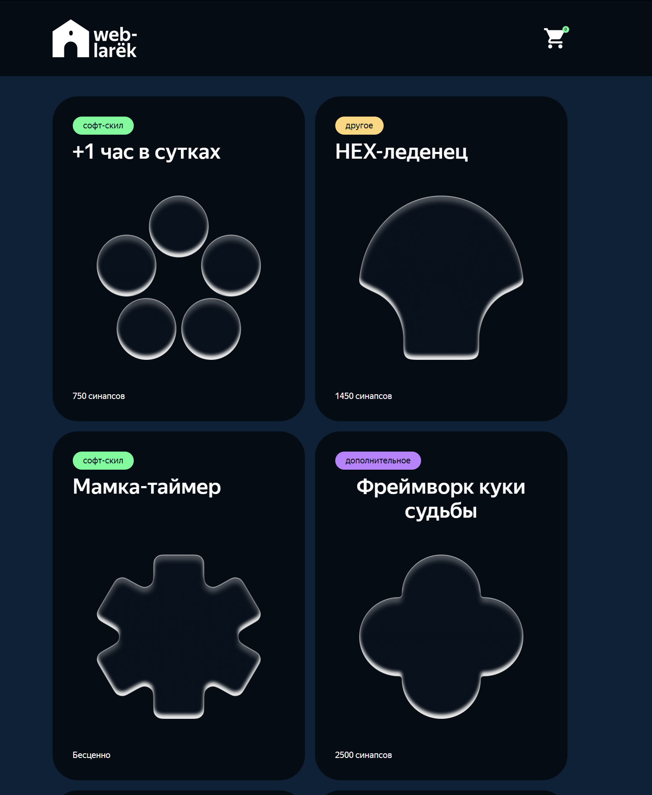
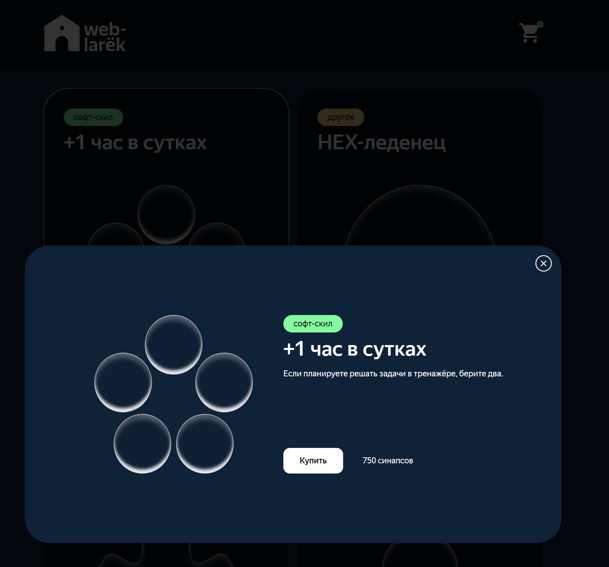
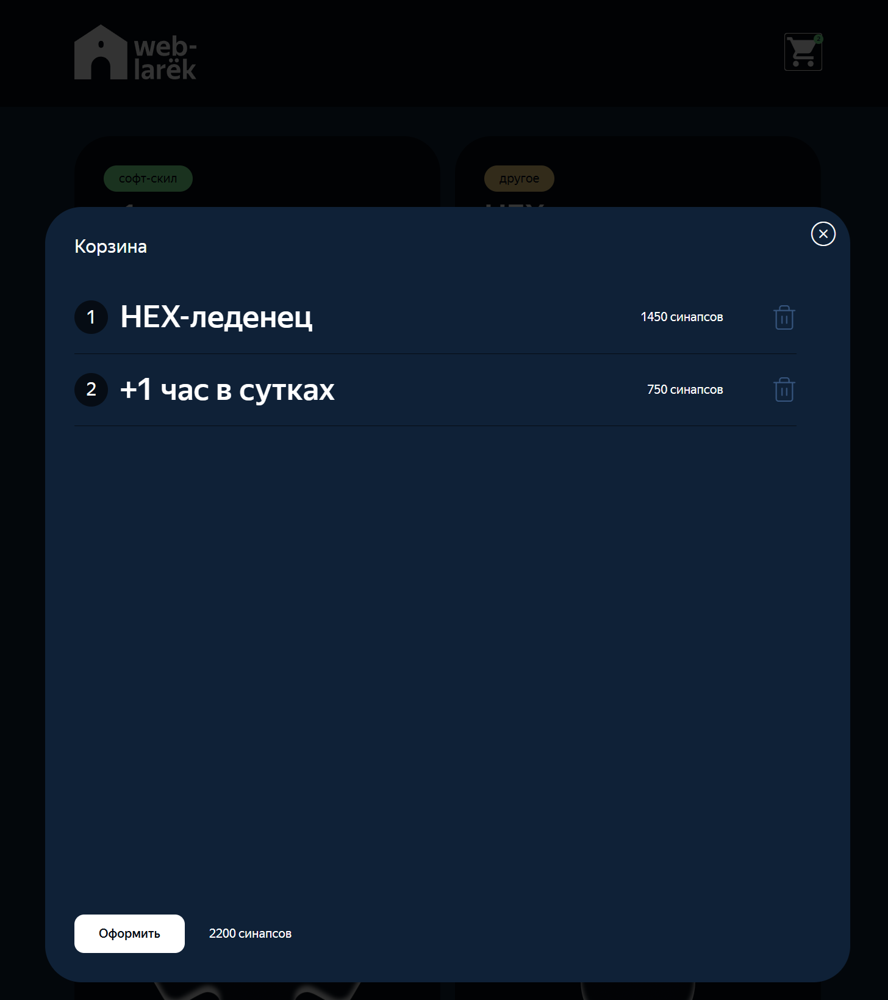
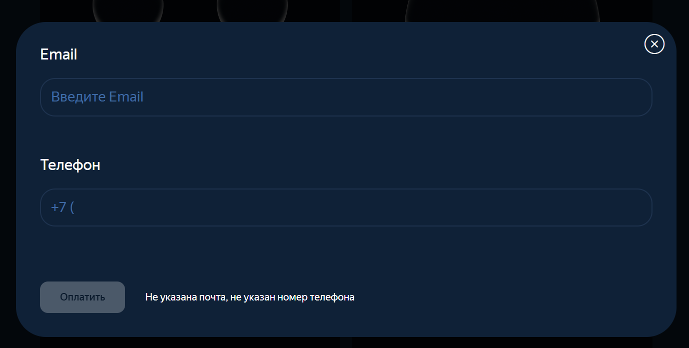
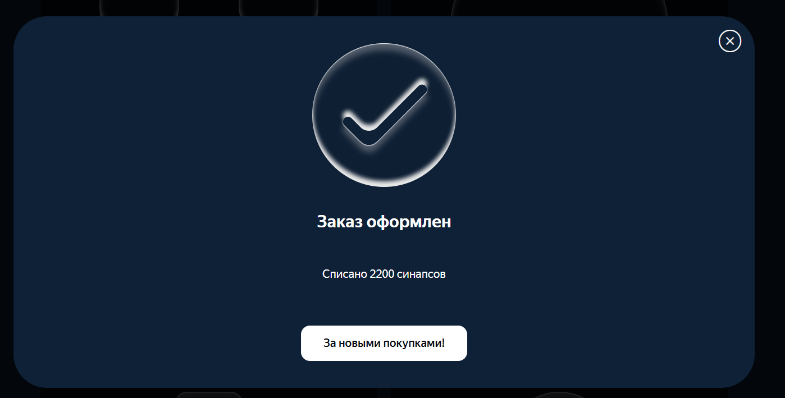

# Проектная работа "Веб-ларек"

Стек: HTML, SCSS, TypeScript, Vite

## Установка и запуск

```bash
npm install
npm run dev
```

Перейти по адресу http://localhost:5173/ (или по выведенному в консоль адресу) в браузере.

## Сборка

```bash
npm run build
```

# Интернет-магазин «Web-Larёk»

«Web-Larёk» — интернет-магазин с товарами для веб-разработчиков. Пользователи могут просматривать каталог, добавлять товары в корзину и оформлять заказы.


## Скриншоты






---

## Архитектура приложения

Приложение построено на архитектурном паттерне **MVP (Model-View-Presenter)**:

- **Model** — слой данных. Отвечает за хранение и изменение данных приложения (каталог товаров, корзина, данные покупателя).
- **View** — слой представления. Отвечает за отображение данных и получение пользовательского ввода. Не содержит бизнес-логики. Хранит только DOM-элементы.
- **Presenter** — связующее звено. Содержит основную логику приложения, обрабатывает события от View и взаимодействует с Model. Все слушатели событий устанавливаются только в конструкторе.

Взаимодействие между компонентами реализовано через **EventEmitter** (событийно-ориентированный подход).

Поток данных строго следует цепочке **V-P-M-P-V**:
1. View сообщает о действии пользователя → Presenter
2. Presenter обновляет Model
3. Model уведомляет об изменении → Presenter  
4. Presenter обновляет View

---

## Структура проекта

```
src/
├── components/
│   ├── base/                 # Базовые классы
│   │   ├── Api.ts                  # HTTP-запросы
│   │   ├── Component.ts            # Базовый компонент View
│   │   └── Events.ts               # Брокер событий
│   ├── models/               # Model слой
│   │   ├── Cart.ts                 # Корзина (реализует ICartModel)
│   │   ├── Catalog.ts              # Каталог товаров (реализует ICatalogModel)
│   │   ├── User.ts                 # Данные покупателя (реализует IUserModel)
│   │   └── UserApi.ts              # API для сервера (реализует IUserApi)
│   ├── views/                # View слой
│   │   ├── Card.ts                 # Базовый класс карточки (хранит только DOM)
│   │   ├── CardCatalog.ts          # Карточка в каталоге (наследуется от Card)
│   │   ├── CardCart.ts             # Карточка в корзине (наследуется от Card)
│   │   ├── CardDetailed.ts         # Открытая карточка (наследуется от CardCatalog)
│   │   ├── CartView.ts             # Корзина (реализует ICartView)
│   │   ├── Form.ts                 # Базовый класс формы
│   │   ├── FormEmailPhone.ts       # Форма email/телефона
│   │   ├── FormPaymentAddress.ts   # Форма оплаты/адреса
│   │   ├── Gallery.ts              # Галерея
│   │   ├── Header.ts               # Шапка сайта (реализует IHeader)
│   │   ├── Modal.ts                # Модальное окно (реализует IModal)
│   │   └── Success.ts              # Окно об успехе (реализует ISuccessView)
│   └── presenter/
│       └── Presenter.ts            # Главный презентер
├── types/
│   └── index.ts                    # Типы данных
├── utils/
│   ├── constants.ts                # Константы
│   └── utils.ts                    # Утилиты
├── pages/
│   └── index.html                  # HTML-страница
├── tests/                          # Тесты
├── scss/
│   └── styles.scss                 # Стили
└── main.ts                         # Точка входа
```

---

## Базовые классы

### Component<T>

Базовый класс для всех компонентов View.

```ts
constructor(container: HTMLElement)
```

| Поле | Тип | Описание |
|------|-----|---------|
| `_container` | `HTMLElement` | Корневой DOM-элемент компонента |

| Метод | Описание |
|-------|---------|
| `render(data?: Partial<T>): HTMLElement` | Возвращает DOM-элемент |
| `setImage(element, src, alt?)` | Устанавливает изображение |
| `get container: HTMLElement` | Геттер DOM-элемента |

---

### Api

Базовый класс для HTTP-запросов.

```ts
constructor(baseUrl: string, options?: RequestInit)
```

| Поле | Тип | Описание |
|------|-----|---------|
| `baseUrl` | `string` | Базовый URL сервера |

| Метод | Описание |
|-------|---------|
| `get<T>(uri): Promise<T>` | GET-запрос |
| `post<T>(uri, data, method?): Promise<T>` | POST-запрос (по умолчанию) |

---

### EventEmitter

Брокер событий (паттерн Observer).

```ts
on<T>(event: string, callback: (data: T) => void): void
emit<T>(event: string, data?: T): void
trigger<T>(event, context?): (data: T) => void
```

---

## Типы данных

### IProduct — Товар

```ts
interface IProduct {
  id: string;
  description: string;
  image: string;
  title: string;
  category: string;
  price: number | null;
}
```

### IUser — Покупатель

```ts
interface IUser {
  payment: TPayment;
  email: string;
  phone: string;
  address: string;
}

type TPayment = 'card' | 'cash' | null;
```

### IUserError — Ошибки валидации

```ts
type IUserError = Partial<Record<keyof IUser, string>>;
```

### Интерфейсы Model-слоя

```ts
interface ICatalogModel {
  setProducts(items: IProduct[]): void;
  getProducts(): IProduct[];
  getProductById(id: string): IProduct | undefined;
}

interface ICartModel {
  getProducts(): IProduct[];
  addProduct(product: IProduct): void;
  removeProduct(product: IProduct): void;
  clear(): void;
  getTotalPrice(): number;
  getCount(): number;
  contains(id: string): boolean;
}

interface IUserModel {
  setUser(user: Partial<IUser>): void;
  clearUser(): void;
  getUser(): IUser;
  validateUser(): IUserError;
}

interface IUserApi {
  get(): Promise<IProducts>;
  post(data: IOrderRequest): Promise<IOrderResponse>;
}
```

### Интерфейсы View-слоя

```ts
interface IModal {
  open(content: HTMLElement): void;
  close(): void;
}

interface IHeader {
  count: number;
}

interface ISuccessView {
  total: string;
  container: HTMLElement;
}

interface ICartView {
  list: HTMLElement[];
  total: string;
  disabled: boolean;
  container: HTMLElement;
}
```

---

## Model слой

### Catalog (реализует ICatalogModel)

Хранит каталог товаров.

```ts
constructor(events: IEvents)
```

| Метод | Описание |
|-------|---------|
| `setProducts(products)` | Установить массив товаров |
| `getProducts(): IProduct[]` | Получить массив товаров |
| `getProductById(id): IProduct \| undefined` | Найти товар по id |

---

### Cart (реализует ICartModel)

Управляет товарами в корзине.

```ts
constructor(events: IEvents)
```

| Метод | Описание |
|-------|---------|
| `getProducts(): IProduct[]` | Получить товары корзины |
| `addProduct(product)` | Добавить товар |
| `removeProduct(product)` | Удалить товар |
| `clear()` | Очистить корзину |
| `getTotalPrice(): number` | Получить общую стоимость |
| `getCount(): number` | Получить количество товаров |
| `contains(id): boolean` | Проверить наличие товара |

---

### User (реализует IUserModel)

Хранит данные покупателя. Валидация данных производится только в модели.

```ts
constructor(events: IEvents)
```

| Метод | Описание |
|-------|---------|
| `setUser(user: Partial<IUser>)` | Сохранить данные |
| `clearUser()` | Очистить данные |
| `getUser(): IUser` | Получить все данные |
| `validateUser(): IUserError` | Валидировать данные |

---

### UserApi (реализует IUserApi)

Взаимодействие с сервером.

```ts
constructor(api: IApi)
```

| Метод | Описание |
|-------|---------|
| `get(): Promise<IProducts>` | Получить каталог |
| `post(order): Promise<IOrderResponse>` | Отправить заказ |

---

## View слой

### Card<T> (абстрактный)

Базовый класс карточки товара. Хранит только DOM-элементы.

```ts
constructor(container: HTMLElement)
```

| Поле | Тип | Описание |
|------|-----|---------|
| `_title` | `HTMLElement` | Название товара |
| `_price` | `HTMLElement` | Цена товара |

| Сеттер | Описание |
|--------|---------|
| `set title(value: string)` | Установить название |
| `set price(value: string)` | Установить цену |
| `set id(value: string)` | Сохранить ID в dataset |

---

### CardCatalog<T> (наследуется от Card<T>)

Карточка товара в каталоге.

```ts
constructor(container: HTMLElement, events: IEvents)
```

| Поле | Тип | Описание |
|------|-----|---------|
| `_image` | `HTMLImageElement` | Изображение |
| `_category` | `HTMLElement` | Категория |

| Сеттер | Описание |
|--------|---------|
| `set image(value: string)` | Установить изображение |
| `set category(value: TCategory)` | Установить категорию |

---

### CardDetailed<T> (наследуется от CardCatalog<T>)

Карточка с подробной информацией. Экземпляр создается один раз в main.ts.

```ts
constructor(container: HTMLElement, events: IEvents)
```

| Поле | Тип | Описание |
|------|-----|---------|
| `_text` | `HTMLElement` | Описание товара |
| `_button` | `HTMLButtonElement` | Кнопка взаимодействия |

| Сеттер | Описание |
|--------|---------|
| `set text(value: string)` | Установить описание |
| `set button(value: TBuyButtonState)` | Установить состояние кнопки |

---

### CardCart<T> (наследуется от Card<T>)

Карточка товара в корзине.

```ts
constructor(container: HTMLElement, events: IEvents)
```

| Поле | Тип | Описание |
|------|-----|---------|
| `_index` | `HTMLElement` | Индекс товара |
| `_deleteButton` | `HTMLButtonElement` | Кнопка удаления |

| Сеттер | Описание |
|--------|---------|
| `set index(value: number)` | Установить индекс |

---

### CartView (реализует ICartView)

Отображение корзины.

```ts
constructor(container: HTMLElement, events: IEvents)
```

| Сеттер | Описание |
|--------|---------|
| `set list(value: HTMLElement[])` | Установить карточки |
| `set total(value: string)` | Установить сумму |
| `set disabled(value: boolean)` | Заблокировать/разблокировать кнопку |

---

### Form (абстрактный)

Базовый класс формы.

```ts
constructor(container: HTMLElement)
```

| Сеттер | Описание |
|--------|---------|
| `set errorText(value: string)` | Установить текст ошибок |
| `set valid(value: boolean)` | Валидность формы |

---

### FormPaymentAddress

Форма выбора оплаты и адреса (1 этап формы).

```ts
constructor(container: HTMLElement, events: IEvents)
```

| Сеттер | Описание |
|--------|---------|
| `set payment(value: TPayment)` | Выбрать способ оплаты |
| `set address(value: string)` | Установить адрес |

---

### FormEmailPhone

Форма ввода контактных данных (2 этап формы).

```ts
constructor(container: HTMLElement, events: IEvents)
```

| Сеттер | Описание |
|--------|---------|
| `set email(value: string)` | Установить email |
| `set phone(value: string)` | Установить телефон |

---

### Modal (реализует IModal)

Модальное окно.

```ts
constructor(container: HTMLElement)
```

| Метод | Описание |
|-------|---------|
| `open(content: HTMLElement)` | Открыть окно |
| `close()` | Закрыть окно |

---

### Header (реализует IHeader)

Шапка сайта.

```ts
constructor(container: HTMLElement, events: IEvents)
```

| Сеттер | Описание |
|--------|---------|
| `set count(value: number)` | Количество товаров в корзине |

---

### Success (реализует ISuccessView)

Окно успешного заказа.

```ts
constructor(container: HTMLElement, events: IEvents)
```

| Сеттер | Описание |
|--------|---------|
| `set total(value: string)` | Установить сумму заказа |

---

## Presenter

Главный презентер, связывающий все компоненты. Все слушатели событий устанавливаются только в конструкторе.

```ts
constructor(
  events: IEvents,
  catalog: ICatalogModel,
  cart: ICartModel,
  user: IUserModel,
  userApi: IUserApi,
  gallery: IGallery,
  modal: IModal,
  header: IHeader,
  success: ISuccessView,
  cartView: ICartView,
  formPaymentAddress: FormPaymentAddress,
  formEmailPhone: FormEmailPhone,
  cardCatalogTemplate: HTMLElement,
  cardCartTemplate: HTMLElement,
  cardDetailed: CardDetailed,
)
```

Presenter использует интерфейсы для взаимодействия с компонентами (инверсия зависимостей).

---

## Поток данных при оформлении заказа

1. Пользователь открывает корзину → `Presenter` получает событие `cart:open-click` → открывает `CartView`
2. Пользователь нажимает «Оформить» → `Presenter` открывает `FormPaymentAddress`
3. Пользователь выбирает оплату/вводит адрес → View эмитит `payment:changed`/`address:changed` → `Presenter` обновляет `User` → `User` эмитит `user:changed` → `Presenter` обновляет форму
4. Нажимает «Далее» → `Presenter` открывает `FormEmailPhone`
5. Заполняет контакты → аналогично этапу 3
6. Нажимает «Оплатить» → `Presenter` отправляет заказ через `UserApi.post()`
7. При успехе → очистка `Cart` и `User` → открытие `Success`

---

## События приложения

### События от View (действия пользователя)

| Событие | Источник | Параметры | Описание |
|---------|----------|-----------|----------|
| `card:select` | `CardCatalog` | `{id: string}` | Выбор карточки товара в каталоге |
| `card:detailed-click` | `CardDetailed` | `{id: string}` | Клик по кнопке в превью товара (добавить/удалить из корзины) |
| `cart:open-click` | `Header` | - | Открытие корзины |
| `cart:card-delete-click` | `CardCart` | `{id: string}` | Удаление товара из корзины |
| `cart:confirm-click` | `CartView` | - | Переход к оформлению заказа |
| `payment:changed` | `FormPaymentAddress` | `{payment: TPayment}` | Изменение способа оплаты |
| `address:changed` | `FormPaymentAddress` | `{address: string}` | Ввод адреса доставки |
| `email:changed` | `FormEmailPhone` | `{email: string}` | Ввод эмейла |
| `phone:changed` | `FormEmailPhone` | `{phone: string}` | Ввод телефона |
| `order:next` | `FormPaymentAddress` | - | Переход к следующему этапу (контакты) |
| `order:submitted` | `FormEmailPhone` | - | Отправка заказа на сервер |
| `success:close` | `Success` | - | Закрытие окна об успешном подтверждении заказа |

### События от Model (изменение данных)

| Событие | Источник | Параметры | Описание |
|---------|----------|-----------|----------|
| `catalog:changed` | `Catalog` | - | Каталог товаров загружен/обновлен |
| `cart:changed` | `Cart` | - | Изменение состава корзины (добавление/удаление/очистка) |
| `user:changed` | `User` | - | Изменение данных пользователя (оплата/адрес/email/телефон) |
| `order:success` | `Presenter` | `IOrderResponse` | Успешное оформление заказа |
